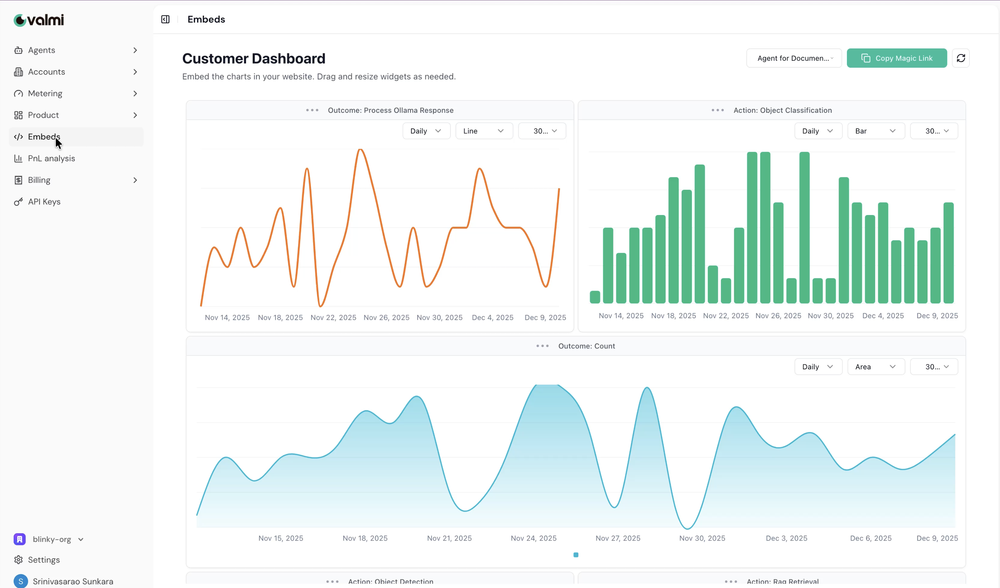
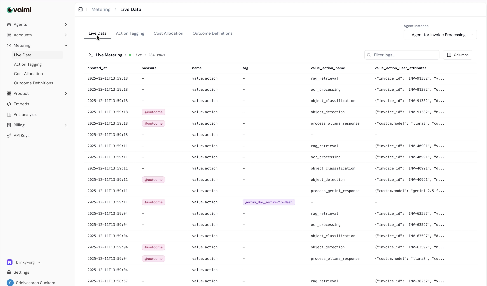
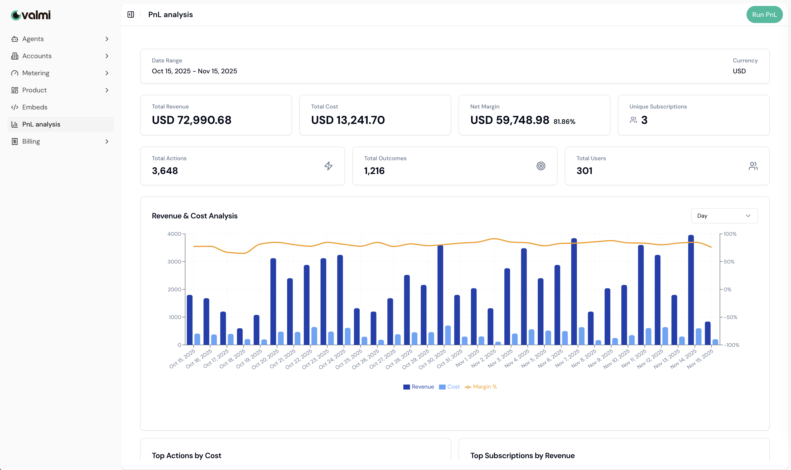
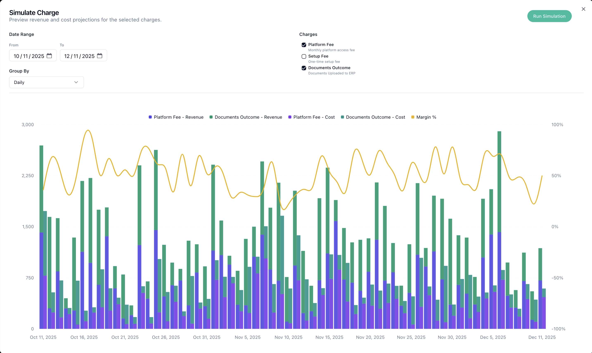

<p align="center">
   <a href="https://www.valmi.io"></a>
</p>

<p align="center">
  <a href="https://www.valmi.io/docs/introduction"></a>
  <a href="https://www.valmi.io/blog/"></a>
  <a href="https://www.valmi.io"></a>

  <a href="https://hub.docker.com/repositories/valmiinfra"></a>
  
</p>

# Value Platform

Outcome-based billing and payments infrastructure for AI agents. Meter usage, configure flexible pricing, and track profitability — so you can focus on building great AI products.

## Overview

Value Platform handles metering, pricing, billing, and revenue tracking for AI agents:

- **AI-Native Metering** — Track tokens, LLM calls, API usage, and outcomes with minimal code
- **Flexible Pricing** — Fixed-Fee, Usage-based, tiered, per-action, per-outcome, or any combination
- **Cost Attribution** — Automatically allocate costs across LLM providers, APIs, and compute
- **Revenue Insights** — Real-time profitability tracking per agent and per customer

## Start Tracking Your AI Agents

Choose your deployment option and start metering in minutes:

---

### ☁️ Option 1: Use Value Cloud

The fastest way to get started — no infrastructure to manage.

**Step 1:** Sign up at 👉 **[value.valmi.io](https://www.value.valmi.io/)**

**Step 2:** Install the SDK and start tracking:

```bash
pip install value-python
```

```python
from value import initialize_sync

client = initialize_sync(agent_secret="your_agent_secret")

with client.action_context(user_id="user_123", anonymous_id="anon_456") as ctx:
    ctx.send(
        action_name="document_processing",
        **{"value.action.description": "Processing invoice", "document_type": "invoice"},
    )
```

That's it! Your agent data flows to Value Cloud automatically.

---

### 🏠 Option 2: Self-Hosted Deployment

Run Value Platform on your own infrastructure for complete control.

**Step 1:** Start the services

```bash
# Prerequisites: Docker & Docker Compose, Make

# Configure environment
cp value-engine/.env.example value-engine/.env
cp value-control-plane-backend/.env.example value-control-plane-backend/.env

# Start all services
make value-up
```

**Step 2:** Install the SDK and point to your local instance:

```bash
pip install value-python
```

```bash
# Set environment variables
export VALUE_BACKEND_URL=http://localhost:8200
export VALUE_OTEL_ENDPOINT=http://localhost:4317
```

```python
from value import initialize_sync

client = initialize_sync(agent_secret="your_agent_secret")

with client.action_context(user_id="user_123", anonymous_id="anon_456") as ctx:
    ctx.send(action_name="document_processing", **{"document_type": "invoice"})
```

**Step 3:** Access your dashboard

| Service           | URL                        |
| ----------------- | -------------------------- |
| Value UI          | http://localhost:3000      |
| Control Plane API | http://localhost:8200/docs |
| Engine API        | http://localhost:8000/docs |
| Celery Flower     | http://localhost:5555      |

```bash
# Stop services
make value-down

# Clean all data volumes
make value-clean-volumes
```

---

📖 See [`sdks/`](./sdks/) for detailed SDK documentation.

## Architecture

```
┌─────────────────┐                              ┌─────────────────┐
│   Value SDK     │─────────────────────────────▶│  Value Engine   │
│  (Python/Node)  │                              │  (Processing)   │
└─────────────────┘                              └────────┬────────┘
                                                          │
                                                          ▼
┌─────────────────┐     ┌──────────────────┐     ┌─────────────────┐
│    Value UI     │◀───▶│  Control Plane   │◀───▶│   Data Store    │
│   (Dashboard)   │     │      (API)       │     │                 │
└─────────────────┘     └──────────────────┘     └─────────────────┘
```

## Screenshots

### Dashboard



### Agents Live Data



### P&L Analysis



### Pricing Simulation



## Services

| Service           | Description                                      | Port |
| ----------------- | ------------------------------------------------ | ---- |
| **Value UI**      | Web dashboard for monitoring and management      | 3000 |
| **Control Plane** | REST API for configuration and data management   | 8200 |
| **Value Engine**  | Data processing pipelines and task orchestration | 8000 |

## Examples

| Example                                                                  | Description            |
| ------------------------------------------------------------------------ | ---------------------- |
| [basic_sync.py](./examples/python/basic_sync.py)                         | Synchronous SDK usage  |
| [basic_async.py](./examples/python/basic_async.py)                       | Async SDK usage        |
| [gemini_instrumentation.py](./examples/python/gemini_instrumentation.py) | Auto-instrument Gemini |
| [pipeline_simulation.py](./examples/python/pipeline_simulation.py)       | Full AI pipeline demo  |

See [`examples/`](./examples/) for more integration examples.

## License

This repository contains components under different licenses:

- **MIT**: `sdks/`, `examples/`, `seed-dummy-data/`
- **ELv2**: `value-control-plane-backend/`, `value-engine/`, `value-ui/`

See [LICENSE](./LICENSE) for details.
